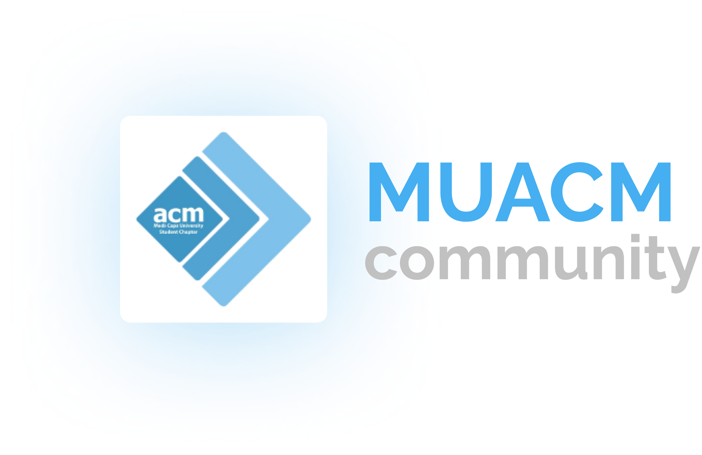

# MUACM Community Website

  <!-- Landing section -->
  
     
    
      <a href="medicaps.hosting.acm.org/">
        Website
      </a>
      &bullet;
      <a href="https://www.linkedin.com/company/acm-student-chapter-medicaps/">
        LinkedIn
      </a>
      &bullet;
      <a href="https://www.instagram.com/mu_acm/">
        Instagram
      </a>
      &bullet;
      <a href="https://medium.com/muacm">
        Medium Blogs
      </a>
    

### Builds, Checks and Code Coverages Status

## Contributors

